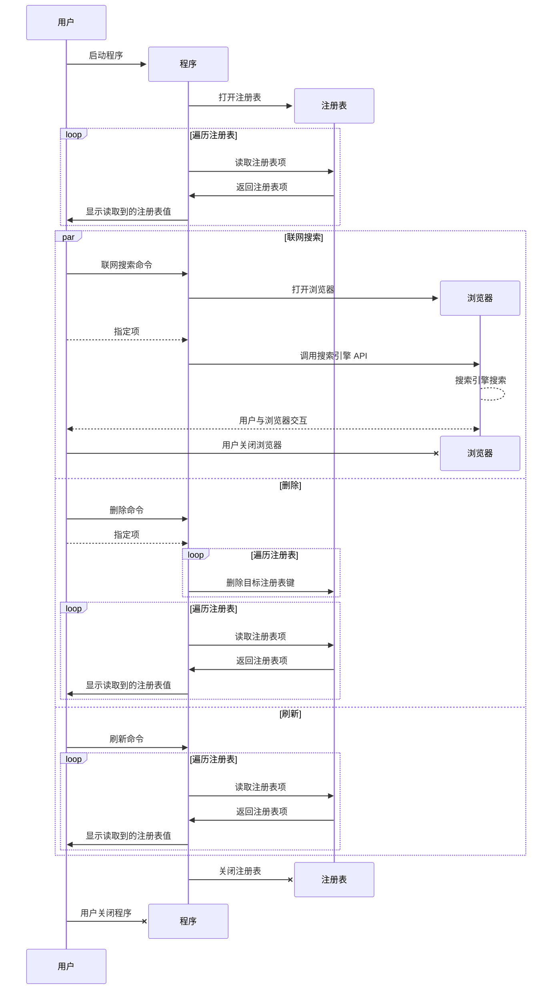

# See My Open With - 查看我的打开方式

一个查看、~~修改~~ 、删除 打开方式 菜单项的小工具. 

基于 .NET 开发.

## 公告
> [!CAUTION]
> 本程序涉及**对系统注册表修改**操作,任何误操作均可能导致**不可挽回**后果! 
>
> 请在专业人员指导或**明白自己在做什么**情况下使用! 
>
> 如出现任何与程序(此处程序指由**本仓库完整代码编译的、未经修改的**或由**本仓库开发者**编译的**发行程序**)本身无关的情况造成财产损失,均由使用者自行承担!

> [!WARNING]
> 本项目惰性开发中,可能出现大量 BUG . 如遇到 BUG 请及时向开发者反馈.
>
> 为了系统安全,请使用最新版本!

[#1](https://github.com/CreationWong/SeeMyOpenWith/discussions/1#discussion-8415471)

## 基础交互逻辑
此处为程序交互与运行逻辑.

## 路线图

- [ ] 基础功能实现
  - [ ] 修改
  - [x] 刷新

- [ ] 完善 UI
- [ ] 添加额外功能
  - [ ] 搜索
  - [x] 热键

- [ ] 添加操作回滚
- [x] 优化代码逻辑
- [x] 采用 .Net 9.0

## 协议

采用 GNU GENERAL PUBLIC LICENSE Version 3 协议分发大部分代码和所有可执行程序.

## 开源软件使用许可

### Serilog

用于程序运行日志记录.

采用 [Apache-2.0 license](https://github.com/serilog/serilog?tab=readme-ov-file#Apache-2.0-1-ov-file) 许可协议

## 安全扫描 & 构建检查

自动构建

## 特别感谢

本项目使用 **JetBrains Rider** 进行代码编写、调试. 使用 **Visual Studio 2022** 进行 UI 绘制、编译.

